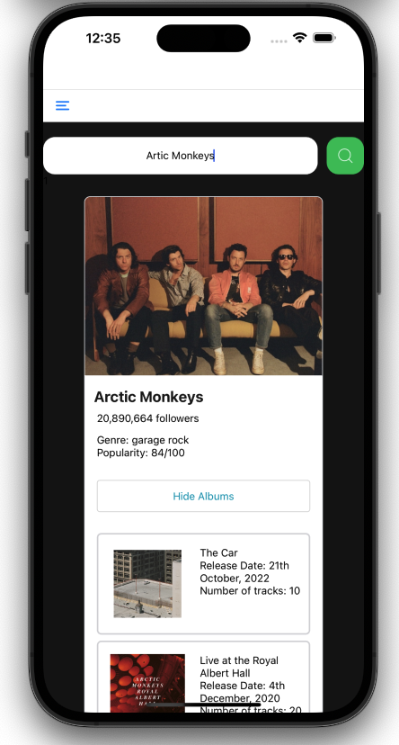
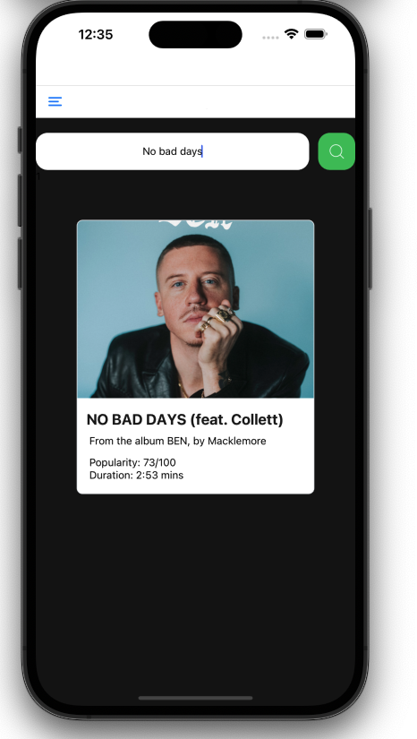
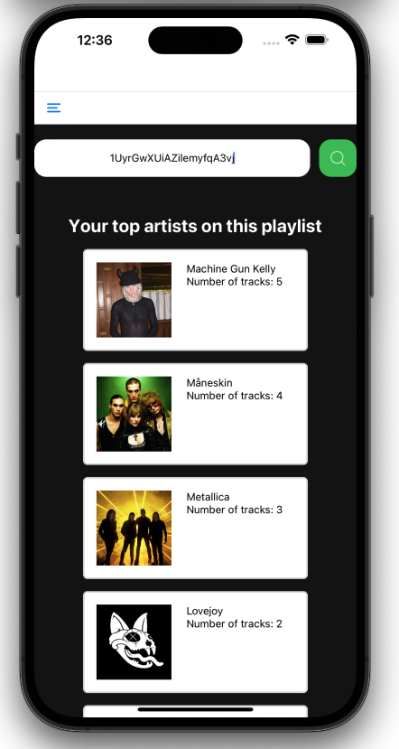
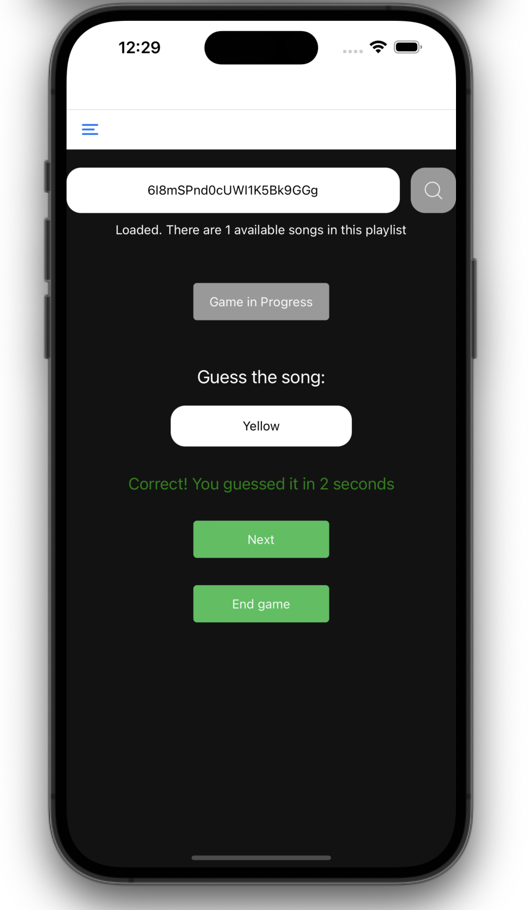

# Spotify React

## About
Mobile app created using React Native which leverages the Spotify API to display information. Allows users to discover insights about their favorite artists and songs, and get detailed statistics about their playlists. 

## Key Features
- Artist and Song information: Explore data on artists and songs
- Playlist analyzer: Gain insights into your playlists
- Guess the song: After inputting a Spotify playlist, the app then randomly plays a song from this playlist, while the user tries to guess the name of the song in the least amount of time possible.

## Installation

```sh
git clone https://github.com/eden-chung/SpotifyReact.git
cd SpotifyReact
npm install
npx expo start
```
## Demos
Artist search:




Song search:




Playlist search:




Guess the song:




